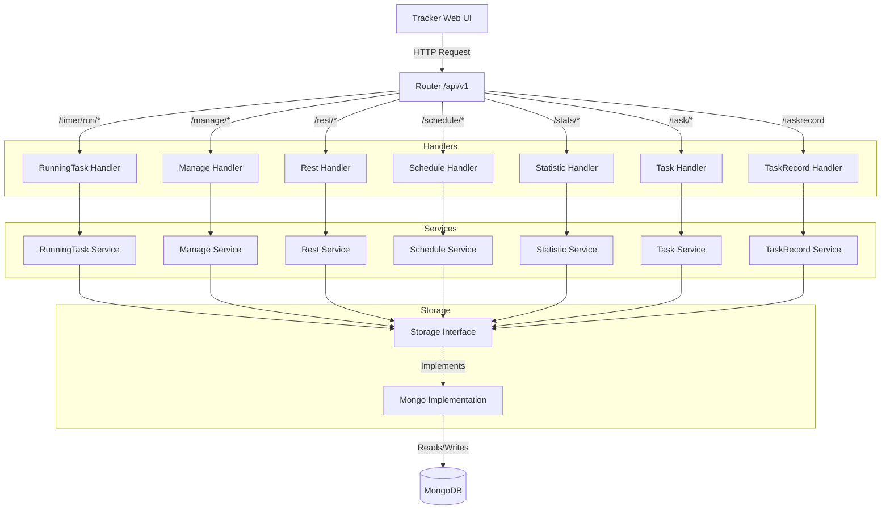

# Tracker Server
Time-tracking REST API (Go/Fiber + MongoDB) for the Tracker project.

## 🚀 Quick Start (Production)
Run the server in production using Docker:

```bash
docker run -d \
  -p 8080:3000 \
  --name tracker \
  --network=tracker \
  -v /home/docker/tracker/config.yaml:/config.yaml \
  ghcr.io/egormak/tracker-server:2026-03-30
```

*Note: Ensure your `config.yaml` is correctly configured and the `tracker` network exists.*

## Overview
- **Roles:** Work, Learn, Rest
- **Architecture:** Handlers → Services → Storage (MongoDB)
- **API Spec:** `openapi.yml`
- **Frontend:** [tracker-web](https://github.com/egormak/tracker-web) (managed separately)

## Project Structure
- `cmd/server/main.go` – Application entrypoint
- `internal/api/handler` – HTTP handlers (Fiber)
- `internal/api/routes/routes.go` – API route definitions
- `internal/services/` – Business logic layer
- `internal/storage/mongo/` – MongoDB persistence adapters
- `config/config.go` – Configuration loader
- `openapi.yml` – API contract (Swagger/OpenAPI)
- `helm/` – Kubernetes deployment manifests

## Configuration
The server requires a `config.yaml` to be mounted at `/config.yaml`:
```yaml
mongodb:
  host: "mongo" # or your mongo IP
  port: 27017
  name: tracker
telegram:
  api_key: "YOUR_TOKEN"
  room_id: "YOUR_ROOM_ID"
```

## Development
### Local Run
```bash
make run  # Runs on :3000 (requires local config.yaml)
```

### Docker Build
```bash
# Build and tag the image
make docker-build TAG=2025-05-07
```

## Make Targets
| Target | Description |
| :--- | :--- |
| `make run` | Run backend locally on :3000 |
| `make build` | Build binary to `bin/server` |
| `make test` | Run all Go tests |
| `make fmt` | Format code with `go fmt` |
| `make docker-build` | Build server Docker image |
| `make docker-prod` | Run the production docker command (defined in Makefile) |
| `make compose-up` | Start API + MongoDB stack |

## Common API Endpoints
See `openapi.yml` for the full specification.
- **Stats:** `GET /api/v1/stats/done/today`
- **Plan:** `GET /api/v1/task/plan/percent`
- **Records:** `POST /api/v1/taskrecord`
- **Timer:** `GET /api/v1/timer/get`, `POST /api/v1/timer/set`

## Architecture Graph

