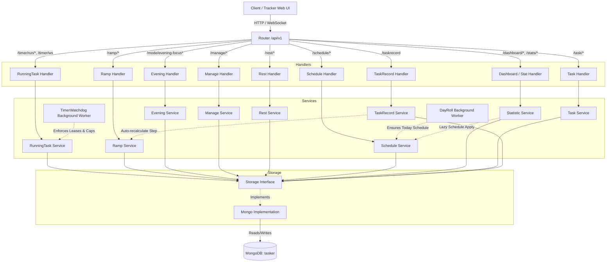

# Tracker Server
Time-tracking REST API (Go/Fiber + MongoDB) for the Tracker project.

## 🚀 Quick Start (Production)
Run the server in production using Docker:

```bash
docker run -d \
  -p 8080:3000 \
  --name tracker \
  --network=tracker \
  -v /home/docker/tracker/config.yaml:/config.yaml \
  ghcr.io/egormak/tracker-server:latest
```

*Note: Ensure your `config.yaml` is correctly configured and the `tracker` network exists.*

## Overview
- **Roles:** Work, Learn, Rest
- **Architecture:** Handlers → Services → Storage (MongoDB)
- **API Spec:** `openapi.yml`
- **Frontend:** [tracker-web](https://github.com/egormak/tracker-web) (managed separately)

## Project Structure
- `cmd/server/main.go` – Application entrypoint (initializes logging, mongo, realtime hub, routes, background workers)
- `internal/api/handler/` – HTTP handlers (Fiber)
- `internal/api/routes/routes.go` – API route definitions and dependency injection
- `internal/api/middleware/` – Telegram authentication middleware
- `internal/realtime/` – WebSocket hub for real-time timer event broadcasting
- `internal/domain/entity/` – Domain model/entity definitions
- `internal/services/` – Business logic layer (tasks, taskrecords, plan, schedule, running_task, ramp, evening, day_roll, timer_watchdog)
- `internal/storage/mongo/` – MongoDB persistence adapters
- `internal/notify/telegram/` – Telegram notification adapter with inline action buttons
- `config/config.go` – Configuration loader
- `openapi.yml` – Authoritative API contract (OpenAPI 3.0)
- `helm/` – Kubernetes deployment manifests

## Configuration
The server requires a `config.yaml` to be mounted at `/config.yaml` (or in the working directory when run locally):
```yaml
mongodb:
  host: "mongo" # or your mongo IP/host
  port: 27017
  name: tasker
telegram:
  api_key: "YOUR_TOKEN"
  room_id: 123456789
  enable_webapp_auth: false
```

## Development
### Local Run
```bash
make run  # Runs on :3000 (requires local config.yaml and running MongoDB)
```

### Docker Build
```bash
# Build and tag the image
make docker-build TAG=2026-09-27
```

## Make Targets
| Target | Description |
| :--- | :--- |
| `make run` | Run backend locally on :3000 |
| `make build` | Build binary to `bin/server` |
| `make test` | Run all Go unit tests (`go test ./...`) |
| `make fmt` | Format code with `go fmt` |
| `make vet` | Static analysis with `go vet` |
| `make tidy` | Sync `go.mod` and `go.sum` |
| `make docker-build` | Build server Docker image |
| `make docker-run` | Run server Docker image in dev mode (maps :3000) |
| `make docker-prod` | Run the production docker container named `tracker` (:8080->:3000) |
| `make docker-stop` | Stop and remove the `tracker` container |
| `make compose-up` | Start API + MongoDB stack via docker-compose |
| `make compose-down`| Stop docker-compose stack and remove volumes |
| `make compose-logs`| Tail docker-compose logs |
| `make all` | Format, vet, and build binary |
| `make clean` | Remove built binaries in `bin/` |

## Common API Endpoints
See `openapi.yml` for the full specification.
- **Dashboard:** `GET /api/v1/dashboard/state`
- **Stats:** `GET /api/v1/stats/done/today`, `GET /api/v1/stats/weekly`
- **Plan:** `GET /api/v1/task/plan/percent`, `GET /api/v1/task/plan/percent/schedule`
- **Records:** `POST /api/v1/taskrecord`
- **Running Task:** `POST /api/v1/timer/run/start`, `POST /api/v1/timer/run/stop`, `POST /api/v1/timer/run/heartbeat`, `GET /api/v1/timer/ws`
- **Ramp Warm-up:** `GET /api/v1/ramp/status`, `POST /api/v1/ramp/advance`
- **Evening Focus:** `GET /api/v1/mode/evening-focus`
- **Schedule:** `GET /api/v1/schedule/active/today`, `POST /api/v1/schedule/apply`

## Architecture Graph

```mermaid
graph TD
    Client[Client / Tracker Web UI] -->|HTTP / WebSocket| Router[Router /api/v1]
    
    subgraph Handlers
        H_Dash[Dashboard / Stat Handler]
        H_RunTask[RunningTask Handler]
        H_Ramp[Ramp Handler]
        H_Eve[Evening Handler]
        H_Manage[Manage Handler]
        H_Rest[Rest Handler]
        H_Sched[Schedule Handler]
        H_Task[Task Handler]
        H_Rec[TaskRecord Handler]
    end
    
    Router -->|/dashboard/*, /stats/*| H_Dash
    Router -->|/timer/run/*, /timer/ws| H_RunTask
    Router -->|/ramp/*| H_Ramp
    Router -->|/mode/evening-focus*| H_Eve
    Router -->|/manage/*| H_Manage
    Router -->|/rest/*| H_Rest
    Router -->|/schedule/*| H_Sched
    Router -->|/task/*| H_Task
    Router -->|/taskrecord| H_Rec

    subgraph Services
        S_RunTask[RunningTask Service]
        S_Ramp[Ramp Service]
        S_Eve[Evening Service]
        S_Manage[Manage Service]
        S_Rest[Rest Service]
        S_Sched[Schedule Service]
        S_Stat[Statistic Service]
        S_Task[Task Service]
        S_Rec[TaskRecord Service]
        W_Watchdog[TimerWatchdog Background Worker]
        W_DayRoll[DayRoll Background Worker]
    end

    H_Dash --> S_Stat
    H_RunTask --> S_RunTask
    H_Ramp --> S_Ramp
    H_Eve --> S_Eve
    H_Manage --> S_Manage
    H_Rest --> S_Rest
    H_Sched --> S_Sched
    H_Task --> S_Task
    H_Rec --> S_Rec

    W_Watchdog -.->|Enforces Leases & Caps| S_RunTask
    W_DayRoll -.->|Ensures Today Schedule| S_Sched
    S_Rec -.->|Auto-recalculate Step| S_Ramp
    S_Stat -.->|Lazy Schedule Apply| S_Sched

    subgraph Storage
        Store[Storage Interface]
        Mongo[Mongo Implementation]
    end

    S_RunTask --> Store
    S_Ramp --> Store
    S_Eve --> Store
    S_Manage --> Store
    S_Rest --> Store
    S_Sched --> Store
    S_Stat --> Store
    S_Task --> Store
    S_Rec --> Store

    Store -.->|Implements| Mongo
    Mongo -->|Reads/Writes| DB[(MongoDB: tasker)]
```
